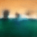
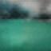

# Non-Adversarial Video Synthesis with Generative Latent Nearest Neighbors - VGLANN

 [](https://packagist.org/packages/buonzz/laravel-4-freegeoip)


### Abstract
Generative video models can impact many applications (e.g., future prediction) in video understanding and simulation. We propose a generative non-adversarial network for video based on GLANN model ([Non-Adversarial Image Synthesis with Generative Latent Nearest Neighbors](https://arxiv.org/abs/1812.08985)), with a spatio-temporal convolutional architecture that untangles the scene’s foreground from the background which is based on MIT model ([Generating Videos with Scene Dynamics](https://arxiv.org/abs/1609.02612)).
The experiments showed that the model provides good but unsatisfactory results.

Read More - [Non-Adversarial Video Synthesis with Generative Latent Nearest Neighbors](https://github.cs.huji.ac.il/daniel023/GLANN-For-Video/blob/master/Non-Adversarial%20Video%20Synthesis%20with%20Generative%20Latent%20Nearest%20Neighbors.pdf)

This repo contains PyTorch code.

Requirements
============
- Python 3+
- Pytorch


Files
============
- [x] **glo.py** - Laplacian Loss

- [x] **icp.py** - IMLE model

- [x] **model_video_orig.py** - MIT model for generating videos (two stream model foreground and background).

- [x] **modelvideo.py** - Expanded  MIT model for generating videos (two stream model foreground and background).

- [x] **perceptual_loss_video.py** - perceptual losses (resnext 101, resnet 50 - 3D model for action recognition, pretrained model on the  Kinetics dataset).

- [x] **resnet.py** - resnet 50 for perceptual loss (forward method has been changed).

- [x] **resnext.py** - resnext 101 for perceptual loss (forward method has been changed).

- [x] **vae.py** - VAE model

- [x] **vgg_metric.py** - VGG perceptual loss

- [x] **train_vae.py** - training and generating a video via vae model (mapping with vae from noise space to a latent space), using the weights og GLO model. run this file with lab_vae.sh

- [x] **train_gmm** - training and generating a video via gmm model (mapping with vae from noise space to a latent space), using the weights og GLO model. run this file with lab_gmm.sh

- [x] **tester_icp** - training and generating a video via imle model (mapping with vae from noise space to a latent space), using the weights og GLO model. run this file with lab_imle.sh

- [x] **tester_video** - training GLO model, run this file with GLANN.sh 

- [x] **glo_video_trainer.py** - training GLO.

- [x] **calc_fvd.py** - calculate FVD score

- [x] **frechet_video_distance.py** - FVD program. copyright to google research.


Getting Started
================

``` 1. download the data from MIT github (link in the paper). and use the data_loader.py for preprocces the data```

```2. run tester_video.py or GLANN.sh. this will train the glo model and you should choose your hyperparams in this file.```

```3. run tester_icp.py / train_vae.py / train_gmm.py for training this models respectively. those files generate a video```

---

## Example (Optional)

```python
run tester_video.py 
run train_vae.py 
```

---

Some Examples
================



